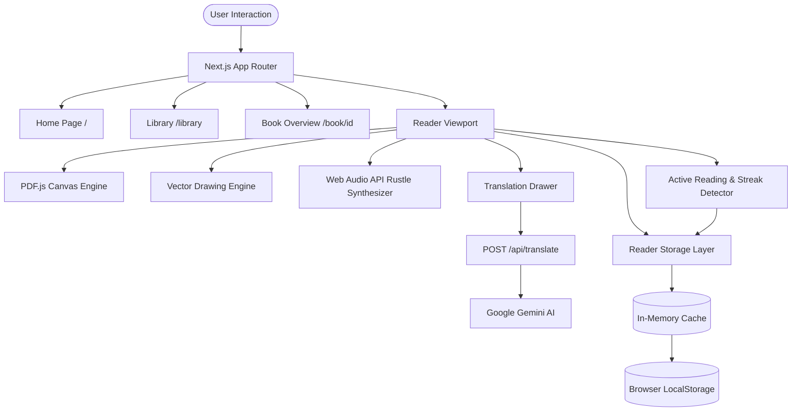

<div align="center">

# 📖 Reader's HUB

### A Private, Local-First Digital Reading & Personal Study Environment

[](https://nextjs.org/)
[](https://react.dev/)
[](https://www.typescriptlang.org/)
[](https://tailwindcss.com/)
[](https://en.wikipedia.org/wiki/Local-first_software)
[](/)

<p align="center">
  <strong>No Login • No Mandatory Backend • Browser-Local Storage • Sub-Second Startup • Reader + Study Workspace</strong>
</p>

<p align="center">
  <em>Reader's HUB is not merely a PDF viewer. It is a high-performance digital sanctuary crafted for deep, barrier-free reading, active annotation, contextual multilingual comprehension, and habit building.</em>
</p>

</div>

---

## 📑 Table of Contents

- [🌟 Why Reader's HUB Is Different](#-why-readers-hub-is-different)
- [✨ Key Feature Matrix](#-key-feature-matrix)
- [📖 The Reader Experience](#-the-reader-experience)
  - [Open Book Spread & Single Page Mode](#open-book-spread--single-page-mode)
  - [3D Kinematic Page Turn & Web Audio Sound](#3d-kinematic-page-turn--web-audio-sound)
  - [Distraction-Free Focus Mode & Fullscreen](#distraction-free-focus-mode--fullscreen)
  - [Precision Hand Pointer Cursor HUD](#precision-hand-pointer-cursor-hud)
- [✍️ Study Tools & Normalized Vector Annotations](#️-study-tools--normalized-vector-annotations)
- [🌐 Contextual Translation System (Gemini API)](#-contextual-translation-system-gemini-api)
- [🪔 Habit Building: Reading Streak & Diwali Diya](#-habit-building-reading-streak--diwali-diya)
- [🧠 Reading Memory & Reading Replay](#-reading-memory--reading-replay)
- [💻 Technical Knowledge Realm](#-technical-knowledge-realm)
- [📚 Curated Catalog Architecture](#-curated-catalog-architecture)
- [🔒 Local-First Architecture & Data Ownership](#-local-first-architecture--data-ownership)
- [🏗 System & Data Flow Architecture](#-system--data-flow-architecture)
- [📂 Project Structure](#-project-structure)
- [🛠 Tech Stack & Tooling](#-tech-stack--tooling)
- [⌨️ Keyboard Shortcuts Reference](#️-keyboard-shortcuts-reference)
- [🚀 Getting Started & Installation](#-getting-started--installation)
- [🔐 Environment Variables](#-environment-variables)
- [⚡ Performance & Engineering Decisions](#-performance--engineering-decisions)
- [⚖️ Trade-offs & Limitations](#️-trade-offs--limitations)
- [❓ Frequently Asked Questions](#-frequently-asked-questions)

---

## 🌟 Why Reader's HUB Is Different

Most digital readers treat reading as passive content consumption. Reader's HUB closes the loop between **discovery, reading, active comprehension, retention, and reflection**:

```text
  ┌──────────────┐
  │   DISCOVER   │  145 Curated Masterworks + Technical Knowledge Realm
  └──────┬───────┘
         ▼
  ┌──────────────┐
  │     READ     │  PDF.js Canvas Engine • 2-Page Open Book • 3D Turn Kinematics
  └──────┬───────┘
         ▼
  ┌──────────────┐
  │   ANNOTATE   │  Freehand Pen • Highlights • Geometric Vectors • Sticky Notes
  └──────┬───────┘
         ▼
  ┌──────────────┐
  │  UNDERSTAND  │  Current-Spread Multilingual Translation (Hindi • Hinglish • English)
  └──────┬───────┘
         ▼
  ┌──────────────┐
  │    TRACK     │  15-Minute Daily Active Goal • Continuous Diya Streak Engine
  └──────┬───────┘
         ▼
  ┌──────────────┐
  │   REMEMBER   │  Reading Memory: Heatmaps, Engagement Maps, Annotation Densities
  └──────┬───────┘
         ▼
  ┌──────────────┐
  │   REVISIT    │  Interactive Reading Replay: Jump directly into historical pages
  └──────────────┘
```

---

## ✨ Key Feature Matrix

| Feature Area | Capability | Implementation / Tech | Status |
| :--- | :--- | :--- | :---: |
| **Catalog Discovery** | 145 Curated Volumes across 9 Top-Level Realms | Static JSON + Metadata Schema | ✅ Active |
| **Technical Library** | 22 Specialized Study Resources (DSA, CS, System Design, SQL, OOP) | Categorized Sub-Filters & Format Badges | ✅ Active |
| **Reader Viewports** | 2-Page Open Book Spread & Responsive Single Page | PDF.js Canvas + High-DPI Scaling | ✅ Active |
| **Page Turns** | Realistic 3D Single-Leaf Paper Curl Kinematics | CSS 3D Matrix Transforms + Origins | ✅ Active |
| **Audio Feedback** | Procedural Paper Rustle Sound Synthesis (Debounced) | Web Audio API (`PageSoundEngine`) | ✅ Active |
| **Vector Annotations** | Pen, Highlighter, Lines, Arrows, Rectangles, Circles, Diamonds, Text | Normalized $[0, 1]$ Vector Coordinates | ✅ Active |
| **Sticky Notes & Bookmarks**| Page-Scoped Sticky Notes & Quick Bookmark Toggles | Browser-Local Storage + In-Memory Map | ✅ Active |
| **Contextual Translation** | Dual-Page Visible Spread Translation (Hindi / Hinglish / English) | Server-Side Gemini API + Client Cache | ✅ Active |
| **Habit & Streaks** | 15-Minute Active Daily Goal with Diwali Diya States | Activity Detector + Idle Timeout Pause | ✅ Active |
| **Reading Memory** | Book-Level Chronological Timelines & Annotation Density Maps | Localized Aggregation Engine | ✅ Active |
| **Reading Replay** | Step-by-Step Historical Session Playback with Direct Page Jump | Interactive Timeline Jump Navigation | ✅ Active |
| **Custom Cursor HUD** | Unified Single Hand/Pointer Cursor across Reader & Fullscreen | React Portal + Hardware Acceleration | ✅ Active |
| **Lighting Themes** | Dark, Sepia, Paper, and Modern High-Contrast Accents | CSS Variable Theming System | ✅ Active |
| **Global Search** | Instant In-Memory Multi-Field Search + Command Palette (`Ctrl+K`) | Tokenized Query Matcher | ✅ Active |
| **Data Portability** | One-Click Full Data JSON Export & Partial Recovery Import | Encrypted/Validated JSON Parser | ✅ Active |

---

## 📖 The Reader Experience

```text
                                Book Reader Architecture
                                
  ┌────────────────────────────────────────────────────────────────────────┐
  │                                Toolbar                                 │
  │   [Zoom]  [Theme]  [Bookmark]  [Study Tools]  [Translate]  [Focus]     │
  └───────────────────────────────────┬────────────────────────────────────┘
                                      │
               ┌──────────────────────┴──────────────────────┐
               ▼                                             ▼
  ┌─────────────────────────────┐               ┌─────────────────────────────┐
  │       Left Page Canvas      │   Spine /     │      Right Page Canvas      │
  │     (PDF.js Canvas View)    │   Shadow      │    (3D Flip Leaf Kinematic) │
  │              +              │   Divider     │              +              │
  │    Vector Annotation Layer  │               │   Vector Annotation Layer   │
  └─────────────────────────────┘               └─────────────────────────────┘
                                      │
               ┌──────────────────────┴──────────────────────┐
               ▼                                             ▼
  ┌─────────────────────────────┐               ┌─────────────────────────────┐
  │   Translation Edge Drawer   │               │   Study Annotation Drawer   │
  │ (Hindi / Hinglish / English)│               │  (Notes, Bookmarks, Layers) │
  └─────────────────────────────┘               └─────────────────────────────┘
```

### Open Book Spread & Single Page Mode
- **Dual-Page Open Book**: Renders authentic adjacent spreads $(P_{\text{left}}, P_{\text{right}})$ on desktop viewports with a book spine shadow divider.
- **Single Page Viewport**: Automatically reflows on mobile devices or when selected in preferences, optimizing vertical real estate.
- **Zoom Engine**: Precision zoom scale from $70\%$ to $150\%$ with high-DPI canvas re-rendering.

### 3D Kinematic Page Turn & Web Audio Sound
- **Physical 3D Curl**: When turning pages forward, only the active right leaf lifts, curls along its spine transform origin (`left center`), casts dynamic page shadows, and settles onto the opposite side.
- **Zero-Payload Sound Synthesis**: Built using the browser's native **Web Audio API** (`lib/pageSound.ts`). Procedural white noise passed through an exponential bandpass filter $(1400\text{Hz} \to 750\text{Hz})$ produces an organic paper rustle without loading external `.mp3` audio files.
- **Rapid Navigation Guard**: $120\text{ms}$ audio debouncing prevents stuttering during rapid page switching.

### Distraction-Free Focus Mode & Fullscreen
- **Focus Mode (`Z`)**: Dims all ambient chrome, headers, and sidebars, spotlighting only the illuminated book leaves.
- **Native Fullscreen**: Seamlessly locks into native browser fullscreen with preserved HUD controls and keyboard shortcuts.

### Precision Hand Pointer Cursor HUD
- Implemented as a single, hardware-accelerated **React Portal cursor** (`components/visual/CustomCursor.tsx`).
- Suppresses default OS cursors globally and renders a clean white hand pointer with crisp outer shadow and micro hover-scale transitions across all viewports, modals, and fullscreen containers with **zero duplication**.

---

## ✍️ Study Tools & Normalized Vector Annotations

Reader's HUB features an integrated vector annotation engine (`components/reader/DrawingCanvas.tsx`):

<details>
<summary><strong>🔍 Click to expand Annotation Tools & Geometry Schema</strong></summary>

### Supported Drawing Tools
1. **Freehand Pen (`P`)**: Smooth Bezier stroke interpolation with customizable stroke width and color.
2. **Text Highlighter (`H`)**: Semi-transparent yellow/mint/cyan highlighter strokes that preserve text readability.
3. **Geometric Vectors**:
   - Line Tool (`L`) & Arrow Tool (`A`)
   - Circle Tool (`C`) & Diamond Tool
   - Rectangle Tool (`R`) & Square Tool
4. **Text Annotations (`T`)**: Direct on-page typography placement with configurable font sizing.
5. **Eraser Tool (`E`)**: Bounding-box stroke intersection eraser.
6. **Undo / Redo (`Ctrl+Z` / `Ctrl+Y`)**: Page-scoped historical transaction stack.

### Normalized Coordinate Persistence
All vector points are stored as normalized floats in the range $[0.0, 1.0]$:
$$x_{\text{normalized}} = \frac{x_{\text{canvas}}}{W_{\text{canvas}}}, \quad y_{\text{normalized}} = \frac{y_{\text{canvas}}}{H_{\text{canvas}}}$$
This guarantees that annotations align with $100\%$ precision regardless of zoom levels, viewport resizes, device pixel ratios, or mobile screen dimensions.

</details>

---

## 🌐 Contextual Translation System (Gemini API)

Reader's HUB features a non-intrusive, page-scoped contextual translator (`lib/translator.ts` + `app/api/translate/route.ts`):

```text
  ┌────────────────────────────────────────────────────────┐
  │ PDF.js Page Extract (Text Layer Fragments & Newlines) │
  └───────────────────────────┬────────────────────────────┘
                              ▼
  ┌────────────────────────────────────────────────────────┐
  │ normalizePdfText() (Paragraph & Whitespace Clean-up)   │
  └───────────────────────────┬────────────────────────────┘
                              ▼
  ┌────────────────────────────────────────────────────────┐
  │ In-Memory Client Cache Check (Map: bookId:page:target) │
  └─────────────┬────────────────────────────┬─────────────┘
                │ Miss                       │ Hit
                ▼                            ▼
  ┌──────────────────────────┐   ┌─────────────────────────┐
  │ POST /api/translate      │   │ Return Cached Spreads   │
  │ (Server-Side Gemini API) │   └─────────────────────────┘
  └─────────────┬────────────┘
                ▼
  ┌────────────────────────────────────────────────────────┐
  │ Translation Drawer (Side-Docked Fullscreen Layer)      │
  │ • Hindi (Devanagari) • Hinglish (Latin) • English      │
  └────────────────────────────────────────────────────────┘
```

- **Spread-Scoped Extraction**: Extracts selectable text *only* from the active 1–2 reading pages, minimizing payload sizes.
- **Languages Supported**:
  - **Hindi**: Clean Devanagari script translation.
  - **Hinglish**: Natural conversational Hindi written in Roman/Latin script (e.g., *"Yeh gyaan vartamaan mein hi upalabdh hai"*).
  - **English**: Clean structured English for foreign works.
- **Security & Privacy**: Client never touches external APIs directly. Requests pass through the server-side API boundary (`app/api/translate/route.ts`), keeping `GEMINI_API_KEY` protected.
- **Stale Request Cancellation**: Instant abort controller termination when navigating to another page before translation completes.

---

## 🪔 Habit Building: Reading Streak & Diwali Diya

Reader's HUB incorporates an authentic habit formation engine (`components/visual/DiwaliDiya.tsx`):

```text
                        Active Reading Detection
                                   │
              ┌────────────────────┴────────────────────┐
              ▼                                         ▼
   [Mouse / Touch / Scroll]                   [Page Navigation / Key]
              │                                         │
              └────────────────────┬────────────────────┘
                                   ▼
                       registerActivity() Trigger
                                   │
        ┌──────────────────────────┴──────────────────────────┐
        ▼                                                     ▼
 [Active Reading Timer]                             [60s Inactivity Timer]
  +1s per active second                              Pauses reading clock
        │
        ▼
 15 Minutes Daily Goal Reached?
        │
        ├──► YES: Diya Ignites into Golden Radiant Flame + Streak +1
        └──► NO:  Diya remains in Amber Ember State
```

- **15-Minute Daily Goal**: Users must actively engage with literature for 15 minutes each calendar day to maintain their flame.
- **Zero Cheating / Real Activity**: Simply leaving a book tab open does *not* increase reading time. The clock pauses on tab blur, window minimization, or 60 seconds of zero interaction.
- **Diwali Diya Flame States**:
  - `Unlit / Dormant`: 0 minutes today.
  - `Ember / Sparking`: Active progress toward the 15-minute goal.
  - `Radiant Flame`: 15-minute goal completed; golden particles ignite.

---

## 🧠 Reading Memory & Reading Replay

Reading Memory (`components/memory/BookReadingMemory.tsx`) is a flagship differentiator that transforms Reader's HUB into a reflective study workspace:

<details>
<summary><strong>🔍 Click to expand Reading Memory & Replay Details</strong></summary>

### Book-Level Memory Timeline
For every book in your collection, Reader's HUB computes:
- **Total Time Invested**: Cumulative active seconds spent on the book.
- **Page Coverage**: Furthest and current page progress percentage.
- **Annotation Density Map**: Identifies which chapters received the heaviest note-taking, highlighting, or bookmarking.
- **Recent Activity Stream**: Timestamps of every highlight, note, and reading milestone.

### Interactive Reading Replay
Reading Replay gives readers a chronological timeline of their intellectual journey:
```text
Day 1: Read Pages 1 → 18  • Created 2 Highlights
Day 3: Read Pages 19 → 42 • Added 1 Sticky Note
Day 7: Read Pages 43 → 85 • Bookmarked Chapter 4
```
**Direct Page Jump**: Readers can click any historical entry in the Replay timeline to jump directly to the exact page where that annotation or thought occurred.

</details>

---

## 💻 Technical Knowledge Realm

To keep the library structured without cluttering the homepage, all 22 technical study assets are consolidated into a dedicated **Technical Knowledge** realm:

```text
                              Technical Knowledge
                                 (22 Resources)
                                       │
        ┌──────────────────────────────┼──────────────────────────────┐
        ▼                              ▼                              ▼
  [Topic Subcategories]         [Format Badges]             [Full Reader System]
  • DSA & Problem Solving       • Technical Books           • Single Page & Spread
  • CS & Systems                • Typed Reference Notes     • Vector Annotations
  • Web & Backend               • Handwritten Notes         • Gemini Translation
  • DBMS & SQL                  • Cheat Sheets              • Offline Caching
  • OOP & Software Design       • Interview Question Sets   • Reading Memory
  • System Design & DevOps
  • Programming Languages
```

### Technical Collection Catalog

| Title | Topic / Subcategory | Format | Pages |
| :--- | :--- | :---: | :---: |
| **Basics of API Testing** | Web & Backend Development | Notes | 28 |
| **Computer Networks Complete Notes** | Computer Science & Systems | Notes | 311 |
| **CSS Complete Reference Notes** | Web & Backend Development | Notes | 72 |
| **DSA Notes That Make Concepts Easy** | DSA & Problem Solving | Notes | 32 |
| **Git & GitHub Quick Reference Cheat Sheet** | System Design & DevOps | Cheat Sheet | 2 |
| **HTML5 Complete Reference Notes** | Web & Backend Development | Notes | 48 |
| **JavaScript Core & Modern ES6+ Notes** | Web & Backend Development | Notes | 45 |
| **Most Useful SQL Practical Notes** | DBMS & SQL | Notes | 68 |
| **Must Solve LeetCode Problems Roadmap** | DSA & Problem Solving | Interview Prep | 58 |
| **Next.js App Router & Architecture Notes** | Web & Backend Development | Notes | 42 |
| **Node.js Backend & Architecture Notes** | Web & Backend Development | Notes | 87 |
| **Object Oriented Programming Fundamentals** | OOP & Software Design | Notes | 10 |
| **Object Oriented Programming Comprehensive Guide** | OOP & Software Design | Book | 330 |
| **OOP with C++ Digital Notes** | OOP & Software Design | Notes | 91 |
| **OOP in C++ Handwritten Study Notes** | OOP & Software Design | Handwritten | 24 |
| **Operating Systems University Notes** | Computer Science & Systems | Notes | 92 |
| **Operating Systems Notes with Illustrated Diagrams**| Computer Science & Systems | Notes | 133 |
| **Python Complete Handwritten Notes** | Programming Languages | Handwritten | 115 |
| **SQL Top 100 Interview Questions & Answers** | DBMS & SQL | Interview Prep | 16 |
| **System Design Complete Architecture Notes** | System Design & DevOps | Notes | 75 |
| **System Design Illustrated Handbook** | System Design & DevOps | Notes | 50 |
| **SQL Interview Preparation Quick Cheatsheet** | DBMS & SQL | Cheat Sheet | 3 |

---

## 📚 Curated Catalog Architecture

Reader's HUB contains **145 total curated works** across 9 top-level realms:

```text
Reader's HUB Collection (145 Items)
├── ⚡ Technical Knowledge (22 Resources)
├── 🏛 Classics (16 Books)
├── 📜 Hindi Literature (14 Books)
├── 🧘 Philosophy & Spirituality (28 Books)
├── 🌱 Self-Development & Psychology (21 Books)
├── 🌌 Fiction & Dystopian (15 Books)
├── 🌹 Romance (8 Books)
├── 📈 Business, Finance & Economics (11 Books)
└── 🐉 Fantasy & Adventure (10 Books)
```

### Data Model Schema (`data/books.ts`)
```typescript
export type ResourceType = "Book" | "Notes" | "HandwrittenNotes" | "CheatSheet" | "InterviewPrep";

export interface Book {
  id: string;              // URL-safe unique identifier
  title: string;           // Title of the work
  author: string;          // Author or Community source
  category: string;        // Categorical genre or topic
  resourceType?: ResourceType; // Format classification
  cover: string;           // Path to optimized WebP cover (/images/books/...)
  pdf: string;             // Path to local PDF asset (/pdfs/...)
  description: string;     // Curated overview and context
  year: number | string;   // Publication or release year
  pages: number | string;  // Total page count
  language: string;        // Primary language
  rating: number;          // Curated rating (out of 5.0)
  featured?: boolean;      // Editorial spotlight inclusion
  tags: string[];          // Taxonomy keywords for search
  excerpt?: string;        // Opening quote or sample passage
}
```

---

## 🔒 Local-First Architecture & Data Ownership

Reader's HUB is built around a **local-first, zero-telemetry philosophy**:

```text
  ┌─────────────────────────────────────────────────────────────┐
  │                      User's Browser                         │
  │                                                             │
  │  ┌────────────────────────┐     ┌────────────────────────┐  │
  │  │      localStorage      │     │       Cache API        │  │
  │  │  • Reading Progress    │     │  • Cached PDF Blobs    │  │
  │  │  • Vector Drawings     │     │  • Book Cover WebP     │  │
  │  │  • Highlights & Notes  │     │  • App Static Shell    │  │
  │  │  • Bookmarks           │     └────────────────────────┘  │
  │  │  • Streak & Diya Data  │                                 │
  │  │  • Reading Memory      │                                 │
  │  └────────────────────────┘                                 │
  └─────────────────────────────────────────────────────────────┘
```

- **No Compulsory Accounts**: Open the web application and begin reading instantly.
- **Your Data Remains Yours**: Reading stats, highlights, annotations, and notes are written to the browser's namespaced `localStorage` and never sent to a tracking backend.
- **Complete Portability**: Full JSON export and validation import engine allows migrating library states across browsers with a single click.

---

## 🏗 System & Data Flow Architecture



---

## 📂 Project Structure

```text
library-optimized/
├── app/                              # Next.js App Router root
│   ├── about/page.tsx                # About & Creator story page
│   ├── api/
│   │   ├── chat/route.ts             # AI Reader Assistant API
│   │   ├── contact/route.ts          # Contact form message endpoint
│   │   └── translate/route.ts        # Server-side Gemini translation API
│   ├── book/[id]/page.tsx            # Dynamic book overview & reader route
│   ├── contact/page.tsx              # Contact & feedback view
│   ├── favorites/page.tsx            # User's saved favorites page
│   ├── library/page.tsx              # Complete catalog explorer with filters
│   ├── globals.css                   # Tailwind v4 & 3D page curl keyframes
│   ├── layout.tsx                    # Root layout with CustomCursor & ThemeProvider
│   └── page.tsx                      # Homepage with Hero, Carousel & Universe
├── components/                       # React modular UI components
│   ├── assistant/                    # AI Library Assistant modal
│   ├── memory/                       # Reading Memory & Replay timeline
│   │   └── BookReadingMemory.tsx
│   ├── reader/                       # Core reader engine components
│   │   ├── AnnotationDrawer.tsx      # Slide-out drawer for bookmarks & notes
│   │   ├── BookReader.tsx            # Full-featured PDF.js reader container
│   │   ├── DrawingCanvas.tsx         # Normalized vector annotation overlay
│   │   └── TranslationDrawer.tsx     # Contextual multilingual translation drawer
│   ├── visual/                       # Visual identity & theme components
│   │   ├── AmbientEffects.tsx        # Subtle backdrop glow shaders
│   │   ├── CardTilt.tsx              # 3D interactive card tilt interaction
│   │   ├── CustomCursor.tsx          # Single universal HUD pointer portal
│   │   ├── DiwaliDiya.tsx            # Streak flame & celebration system
│   │   ├── NavbarThemeControl.tsx    # Theme & Diya streak popover
│   │   └── ReadingUniverse.tsx       # Constellation realm explorer
│   ├── BookCard.tsx                  # Standard book card with resource badge
│   ├── CategoryPills.tsx             # Interactive category & subtopic filter bar
│   ├── FeaturedCarousel.tsx          # Editorial spotlight carousel
│   ├── HeroVideo.tsx                 # Ambient cinematic video header
│   ├── Navbar.tsx                    # Navigation bar with quick search trigger
│   └── SearchModal.tsx               # Instant in-memory search modal (Ctrl+K)
├── context/                          # React context providers
│   └── LibraryContext.tsx            # Memoized global favorites & reading state
├── data/                             # Curated catalog datasets
│   ├── books.json                    # 145 books & technical resources
│   └── books.ts                      # Metadata types, categories & filter helpers
├── lib/                              # Core utilities and engines
│   ├── library-assistant.ts          # Contextual book assistant logic
│   ├── pageSound.ts                  # Procedural Web Audio API sound synthesizer
│   ├── reader-storage.ts             # Centralized local-first storage manager
│   └── translator.ts                 # Page extraction & client translation cache
├── public/                           # Static assets
│   ├── images/books/                 # High-resolution WebP book covers (145 files)
│   ├── pdfs/                         # Canonical PDF assets (145 files)
│   └── manifest.json                 # PWA Web App Manifest
├── next.config.ts                    # Next.js 16 production configuration
├── package.json                      # Dependencies & build scripts
└── tsconfig.json                     # TypeScript compiler options
```

---

## 🛠 Tech Stack & Tooling

<div align="center">

| Layer | Technology | Purpose |
| :--- | :--- | :--- |
| **Framework** | **Next.js 16.2.1 (Turbopack)** | Static Site Generation (SSG), App Router, API Routes |
| **UI Library** | **React 19.2.4** | Server & Client Components, Concurrent Mode, Hooks |
| **Language** | **TypeScript 5.0** | Full Type Safety, Strict Schema Interfaces |
| **Styling** | **Tailwind CSS v4** | Modern Utility-First CSS, Design Tokens, 3D Keyframes |
| **Document Rendering**| **PDF.js (`pdfjs-dist` 6.2.108)** | Client-Side Canvas Rasterization & Text Extraction |
| **Audio Engine** | **Web Audio API** | Zero-Payload Procedural Paper Rustle Sound Synthesis |
| **AI Translation** | **`@google/genai` (Gemini API)** | Multilingual Spread Translation (Hindi, Hinglish, English)|
| **Image Pipeline** | **Sharp 0.35.3** | High-Resolution WebP Cover Optimization |
| **Persistence** | **Browser `localStorage` & Cache** | Local-First Zero-Backend User State Storage |

</div>

---

## ⌨️ Keyboard Shortcuts Reference

The Reader and Library contain built-in keyboard shortcuts for power readers:

| Shortcut | Context | Action |
| :--- | :--- | :--- |
| <kbd>Ctrl</kbd> + <kbd>K</kbd> / <kbd>Cmd</kbd> + <kbd>K</kbd> | Global | Open Instant Search & Command Palette |
| <kbd>Ctrl</kbd> + <kbd>F</kbd> / <kbd>Cmd</kbd> + <kbd>F</kbd> | Book Reader | Search Text Inside Active Book |
| <kbd>→</kbd> / <kbd>PageDown</kbd> / <kbd>Space</kbd> | Book Reader | Turn to Next Page (with 3D Leaf Flip & Audio) |
| <kbd>←</kbd> / <kbd>PageUp</kbd> | Book Reader | Turn to Previous Page |
| <kbd>Home</kbd> / <kbd>End</kbd> | Book Reader | Jump to First Page / Last Page |
| <kbd>Z</kbd> | Book Reader | Toggle Distraction-Free Focus Mode |
| <kbd>T</kbd> | Book Reader | Open Page Translation (or Text Tool in Study Mode) |
| <kbd>B</kbd> | Book Reader | Toggle Bookmark on Current Page |
| <kbd>P</kbd> | Book Reader | Select Freehand Pen Tool |
| <kbd>H</kbd> | Book Reader | Select Highlighter Tool |
| <kbd>L</kbd> | Book Reader | Select Line Tool |
| <kbd>A</kbd> | Book Reader | Select Arrow Tool |
| <kbd>C</kbd> | Book Reader | Select Circle Tool |
| <kbd>R</kbd> | Book Reader | Select Rectangle Tool |
| <kbd>E</kbd> | Book Reader | Select Eraser Tool |
| <kbd>Ctrl</kbd> + <kbd>+</kbd> / <kbd>Ctrl</kbd> + <kbd>-</kbd> | Book Reader | Zoom In / Zoom Out ($70\% - 150\%$) |
| <kbd>Ctrl</kbd> + <kbd>0</kbd> | Book Reader | Reset Zoom to $100\%$ |
| <kbd>Ctrl</kbd> + <kbd>Z</kbd> / <kbd>Ctrl</kbd> + <kbd>Y</kbd> | Book Reader | Undo / Redo Annotation Stroke |
| <kbd>Esc</kbd> | Global | Close Drawers, Modals, or Search Palette |

---

## 🚀 Getting Started & Installation

### Prerequisites
- **Node.js**: `v18.18.0` or higher (Node 20+ recommended)
- **npm** or **pnpm**

### 1. Clone the Repository
```bash
git clone https://github.com/amandubey923/library-optimized.git
cd library-optimized
```

### 2. Install Dependencies
```bash
npm install
```

### 3. Configure Environment Variables
Create a local `.env` file in the root directory:
```bash
cp .env.example .env
```
*(See [Environment Variables](#-environment-variables) for API keys)*

### 4. Run Development Server
```bash
npm run dev
```
Open [http://localhost:3000](http://localhost:3000) in your browser.

### 5. Build for Production
```bash
npm run build
npm run start
```
Generates 158 static pages in ~5.2 seconds with Turbopack.

---

## 🔐 Environment Variables

| Variable | Required | Scope | Description |
| :--- | :---: | :---: | :--- |
| `GEMINI_API_KEY` | Optional | Server-Side | Google Gemini API key for contextual Hindi/Hinglish/English page translation. |
| `RESEND_API_KEY` | Optional | Server-Side | Resend API key for contact form submission emails. |
| `CONTACT_EMAIL` | Optional | Server-Side | Destination email address for feedback submissions. |

*Note: The reader and all 145 books operate completely offline without any API keys configured. API keys are only required for the optional AI translation and contact features.*

---

## ⚡ Performance & Engineering Decisions

1. **Sub-Second Static Compilation**: Utilizes Next.js App Router with `generateStaticParams()` to pre-render all 145 dynamic `/book/[id]` pages at build time.
2. **Decoupled Asset Identifiers**: Book IDs are clean URL slugs (`crime-and-punishment`), decoupled from physical PDF filenames (`CrimeAndPunishmentFyodorDostoevsky.pdf`), preventing brittle file path breaks.
3. **In-Memory Caching Architecture**: `lib/reader-storage.ts` maintains an in-memory `Map` mirror of `localStorage` writes, reducing expensive JSON parse/stringify operations during high-frequency drawing and page navigation.
4. **Context Value Memoization**: `LibraryContext.tsx` wraps all provided states in `useMemo`, preventing cascading re-renders across the navbar and home carousel when marking favorites.
5. **Procedural Web Audio Engine**: Audio rustles are synthesized in real-time via math curves instead of loading audio media over the network.
6. **Hardware-Accelerated Single Cursor**: Universal single cursor HUD mounts via React Portal with CSS transforms, preventing layout thrashing and cursor duplication.

---

## ⚖️ Trade-offs & Limitations

- **Local Storage Scope**: Because data is stored in browser-local storage, reading progress does not automatically sync across separate physical devices without using the manual JSON Export/Import feature.
- **Scanned vs Text PDFs**: Contextual translation requires readable text layers within the PDF. Pure image-scanned historical documents without embedded OCR text cannot be extracted by PDF.js text layer.
- **Browser Storage Quota**: Offline PDF storage relies on the browser's Cache API; browsers may purge caches if device disk space is critically constrained.

---

## ❓ Frequently Asked Questions

<details>
<summary><strong>Do I need to sign up or create an account to use Reader's HUB?</strong></summary>
No. Reader's HUB is completely barrier-free. You can open any book, take notes, highlight passages, and track your streaks with zero sign-ups or login credentials.
</details>

<details>
<summary><strong>Will my notes and reading progress disappear if I refresh the page?</strong></summary>
No. All annotations, highlights, bookmarks, reading progress, and streak statistics are instantly persisted in your browser's namespaced local storage.
</details>

<details>
<summary><strong>Can I export my reading data to another computer?</strong></summary>
Yes. In the reader or settings, click "Export Reading Data" to download a complete JSON backup of your highlights, notes, bookmarks, and streaks, and import it onto any other device.
</details>

<details>
<summary><strong>How does the translation feature work?</strong></summary>
When you open translation, the reader extracts text from the currently visible 1–2 pages, normalizes the paragraphs, and queries the secure server-side Gemini API endpoint, displaying the translated spread side-by-side in a docked drawer.
</details>

---

<div align="center">

### Built for the Love of Literature & Focused Learning

Crafted with Next.js 16, React 19, TypeScript, and Tailwind CSS.

[Explore Library](http://localhost:3000/library) • [Technical Knowledge](http://localhost:3000/library?category=Technical%20Knowledge) • [About the Project](http://localhost:3000/about)

</div>
